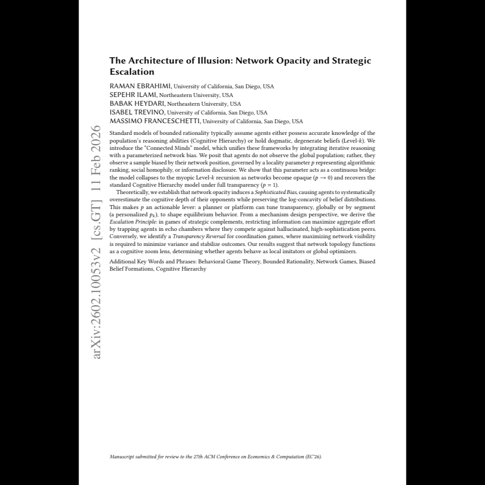

---

##### Abstract

Standard models of bounded rationality typically assume agents either possess accurate knowledge of the population's reasoning abilities (Cognitive Hierarchy) or hold dogmatic, degenerate beliefs (Level-$k$). We introduce the ``Connected Minds'' model, which unifies these frameworks by integrating iterative reasoning with a parameterized network bias. We posit that agents do not observe the global population; rather, they observe a sample biased by their network position, governed by a locality parameter $p$ representing algorithmic ranking, social homophily, or information disclosure. We show that this parameter acts as a continuous bridge: the model collapses to the myopic Level-$k$ recursion as networks become opaque ($p \to 0$) and recovers the standard Cognitive Hierarchy model under full transparency ($p=1$). Theoretically, we establish that network opacity induces a \emph{Sophisticated Bias}, causing agents to systematically overestimate the cognitive depth of their opponents while preserving the log-concavity of belief distributions. This makes $p$ an actionable lever: a planner or platform can tune transparency, globally or by segment (a personalized $p_k$), to shape equilibrium behavior. From a mechanism design perspective, we derive the \emph{Escalation Principle}: in games of strategic complements, restricting information can maximize aggregate effort by trapping agents in echo chambers where they compete against hallucinated, high-sophistication peers. Conversely, we identify a \emph{Transparency Reversal} for coordination games, where maximizing network visibility is required to minimize variance and stabilize outcomes. Our results suggest that network topology functions as a cognitive zoom lens, determining whether agents behave as local imitators or global optimizers.

---

##### First page

