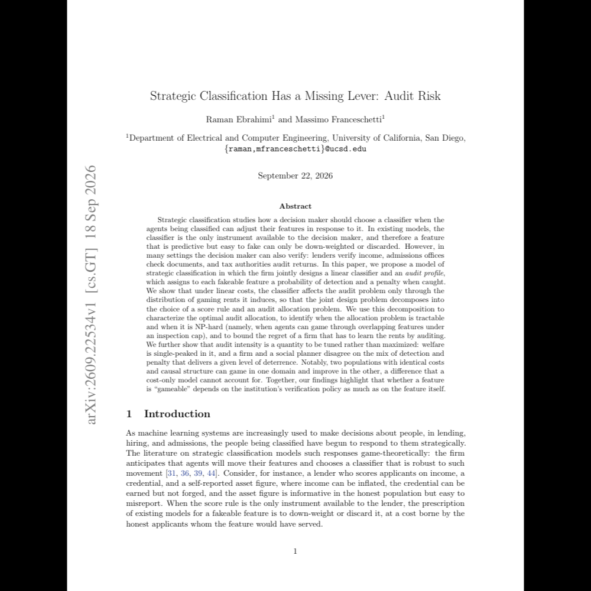

---

##### Abstract

Strategic classification studies how a decision maker should choose a classifier when the agents being classified can adjust their features in response to it. In existing models, the classifier is the only instrument available to the decision maker, and therefore a feature that is predictive but easy to fake can only be down-weighted or discarded. However, in many settings the decision maker can also verify: lenders verify income, admissions offices check documents, and tax authorities audit returns. In this paper, we propose a model of strategic classification in which the firm jointly designs a linear classifier and an \emph{audit profile}, which assigns to each fakeable feature a probability of detection and a penalty when caught. We show that under linear costs, the classifier affects the audit problem only through the distribution of gaming rents it induces, so that the joint design problem decomposes into the choice of a score rule and an audit allocation problem. We use this decomposition to characterize the optimal audit allocation, to identify when the allocation problem is tractable and when it is NP-hard (namely, when agents can game through overlapping features under an inspection cap), and to bound the regret of a firm that has to learn the rents by auditing. We further show that audit intensity is a quantity to be tuned rather than maximized: welfare is single-peaked in it, and a firm and a social planner disagree on the mix of detection and penalty that delivers a given level of deterrence. Notably, two populations with identical costs and causal structure can game in one domain and improve in the other, a difference that a cost-only model cannot account for. Together, our findings highlight that whether a feature is ``gameable'' depends on the institution's verification policy as much as on the feature itself.

---

##### First page

