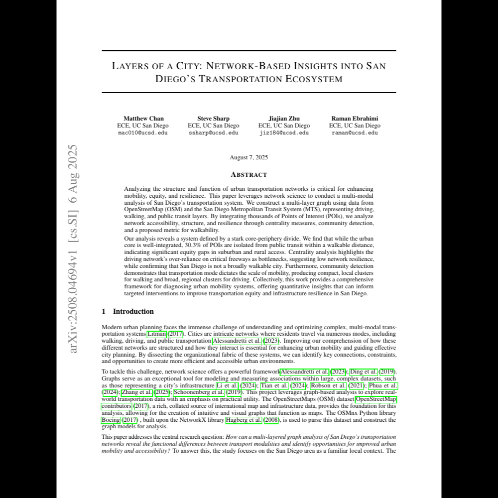

---

##### Abstract

Analyzing the structure and function of urban transportation networks is critical for enhancing mobility, equity, and resilience. This paper leverages network science to conduct a multi-modal analysis of San Diego's transportation system. We construct a multi-layer graph using data from OpenStreetMap (OSM) and the San Diego Metropolitan Transit System (MTS), representing driving, walking, and public transit layers. By integrating thousands of Points of Interest (POIs), we analyze network accessibility, structure, and resilience through centrality measures, community detection, and a proposed metric for walkability. Our analysis reveals a system defined by a stark core-periphery divide. We find that while the urban core is well-integrated, 30.3% of POIs are isolated from public transit within a walkable distance, indicating significant equity gaps in suburban and rural access. Centrality analysis highlights the driving network's over-reliance on critical freeways as bottlenecks, suggesting low network resilience, while confirming that San Diego is not a broadly walkable city. Furthermore, community detection demonstrates that transportation mode dictates the scale of mobility, producing compact, local clusters for walking and broad, regional clusters for driving. Collectively, this work provides a comprehensive framework for diagnosing urban mobility systems, offering quantitative insights that can inform targeted interventions to improve transportation equity and infrastructure resilience in San Diego.

---

##### First page

