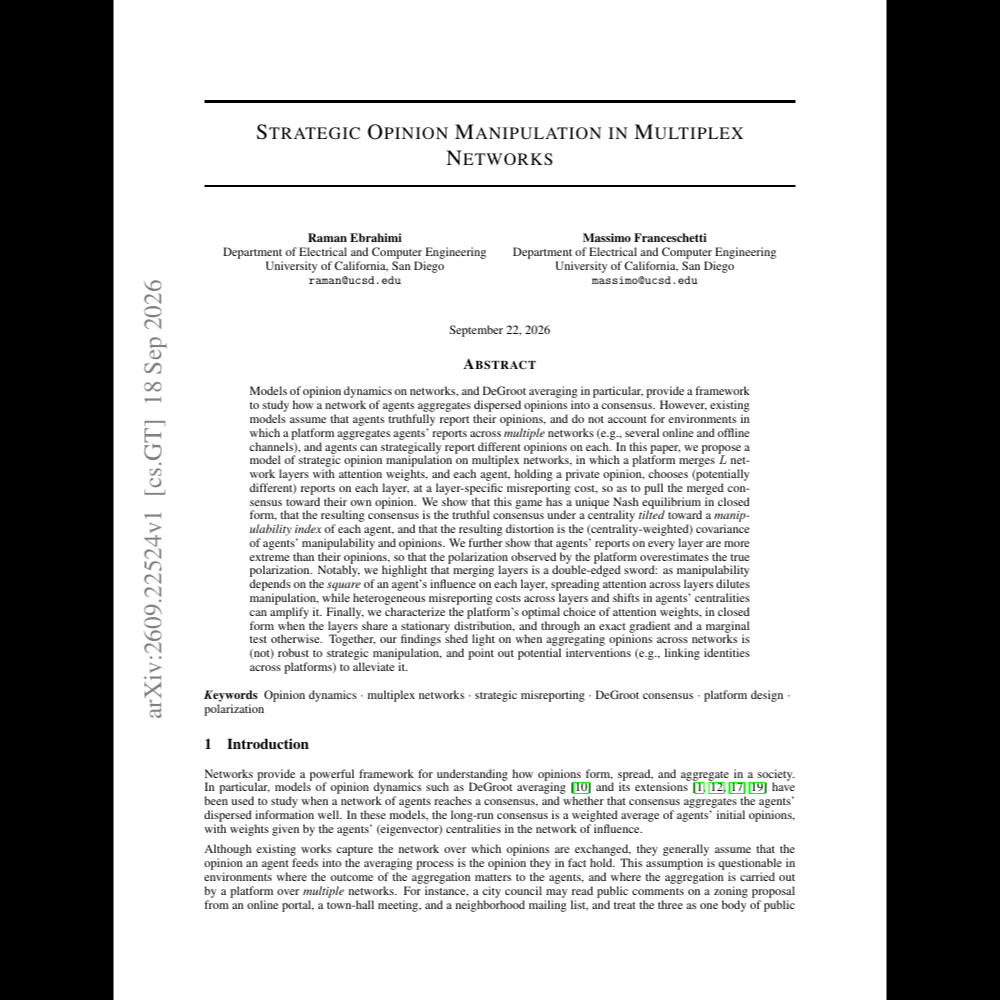

---

##### Abstract

Models of opinion dynamics on networks, provide a framework to study how a network of agents aggregates dispersed opinions into a consensus. However, existing models assume that agents truthfully report their opinions, and do not account for environments in which a platform aggregates agents' reports across multiple networks, and agents can strategically report different opinions on each. In this paper, we propose a model of strategic opinion manipulation on multiplex networks, in which a platform merges L network layers with attention weights, and each agent, holding a private opinion, chooses (potentially different) reports on each layer, at a layer-specific misreporting cost, so as to pull the merged consensus toward their own opinion. We show that this game has a unique Nash equilibrium in closed form, that the resulting consensus is the truthful consensus under a centrality tilted toward a manipulability index of each agent, and that the resulting distortion is the (centrality-weighted) covariance of agents' manipulability and opinions. We further show that agents' reports on every layer are more extreme than their opinions, so that the polarization observed by the platform overestimates the true polarization. Notably, we highlight that merging layers is a double-edged sword: as manipulability depends on the square of an agent's influence on each layer, spreading attention across layers dilutes manipulation, while heterogeneous misreporting costs across layers and shifts in agents' centralities can amplify it. Finally, we characterize the platform's optimal choice of attention weights, in closed form when the layers share a stationary distribution, and through an exact gradient and a marginal test otherwise. Together, our findings shed light on when aggregating opinions across networks is (not) robust to strategic manipulation, and point out potential interventions to alleviate it.

---

##### First page

