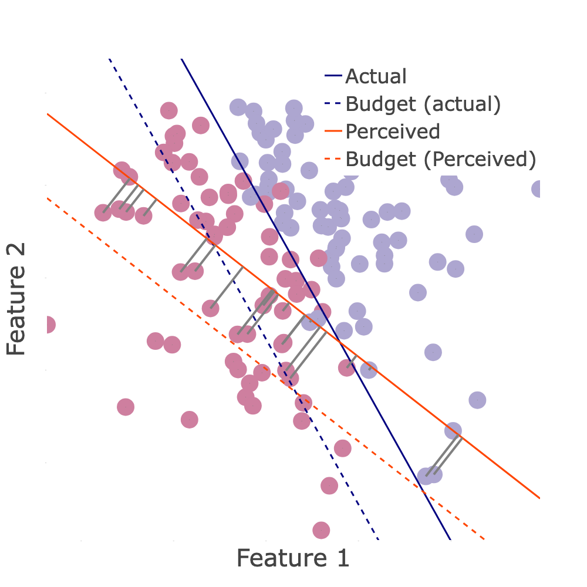

---

##### Abstract

When humans are subject to an algorithmic decision system, they can strategically adjust their behavior accordingly (“game” the system). While a growing line of literature on strategic classification has used game-theoretic modeling to understand and mitigate such gaming, these existing works commonly consider standard models of fully rational agents. In this paper, we propose a strategic classification model that considers behavioral biases in human responses to algorithms. We show how misperceptions of a classifier (specifically, of its feature weights) can lead to different types of discrepancies between biased and rational agents’ responses, and identify when behavioral agents over- or under-invest in different features. We also show that strategic agents with behavioral biases can benefit or (perhaps, unexpectedly) harm the firm compared to fully rational strategic agents. We complement our analytical results with user studies, which support our hypothesis of behavioral biases in human responses to the algorithm. Together, our findings highlight the need to account for human (cognitive) biases when designing AI systems, and providing explanations of them, to strategic human in the loop.

---

##### Figure

---
