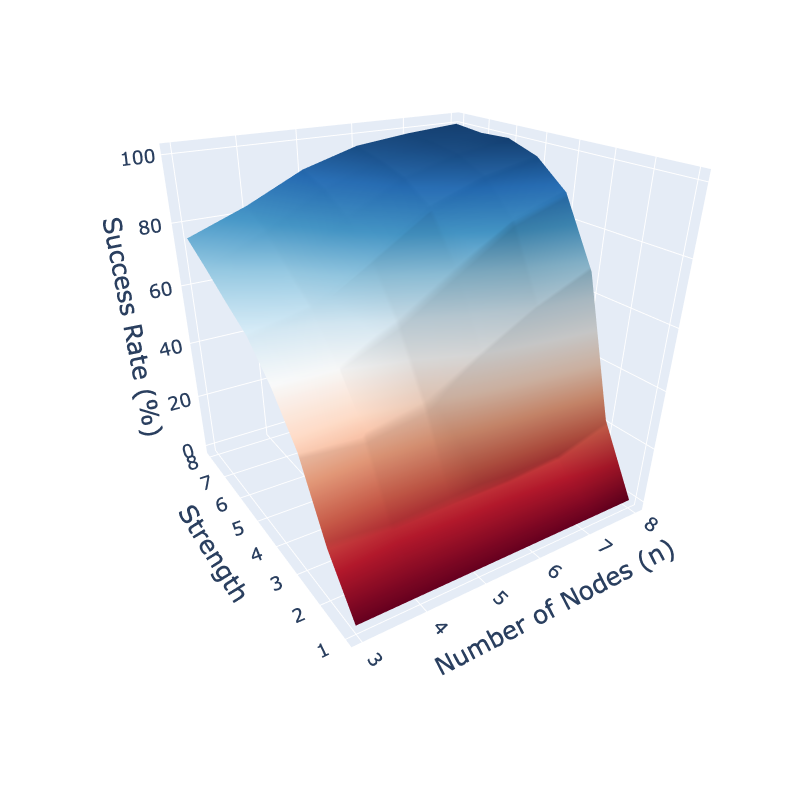

---

##### Abstract

Network games provide a framework to study strategic decision-making processes that are governed by structured interdependencies among agents. However, existing models do not account for environments in which agents simultaneously interact over multiple networks, or when agents operate over multiple action dimensions. In this article, we propose new models of multiplex network games to capture the different modalities of interactions among strategic agents, and multilayer network games to capture their interactions over multiple action dimensions. We explore how the properties of the constituent networks of a multiplex/multilayer network can undermine or support the existence, uniqueness, and stability of the game's Nash equilibria. Notably, we highlight that both the largest and smallest eigenvalues of the constituent networks (reflecting their connectivity and two-sidedness, respectively) are instrumental in determining the uniqueness of the multiplex/multilayer network game's equilibrium. Together, our findings shed light on the reasons for the fragility of equilibria when agents interact over networks of networks, and point out potential interventions to alleviate them.

---

##### Figure

---
