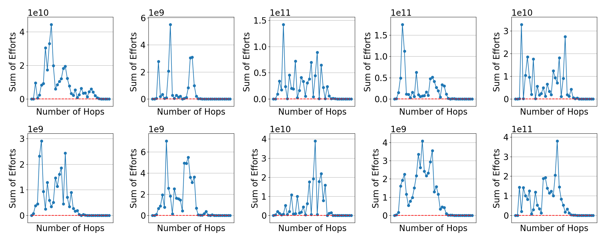

---

##### Abstract

Network/interdependent security games have been extensively used in the literature to gain insights into how firms make optimal security decisions when accounting for spillovers of risks from other firms with whom they have risk interdependencies. We extend these models by proposing K-hop network (security) games, in which agents have extended awareness of network effects: an agent in a K-hop network game accounts for not only its immediate neighbors (those with whom it directly has joint operations or shared infrastructure), but also the spillover of the (security) risks from agents up to K-hops away from it. We first establish an equivalence between our proposed K-hop network games and a one-hop game played on an appropriately defined adjacency matrix. Then, through analytical results and numerical examples, we illustrate how subtle changes in a network can significantly alter equilibrium behaviors when accounting for multi-hop risk spillovers, emphasizing the dependency of agents’ efforts on the nature of their dependencies (complement vs. substitute nature of efforts), agents’ different levels K of awareness of the network effects, and the reactive vs. passive nature of lower awareness (lower K) agents to those with higher awareness (higher K). Our findings show that extended awareness of network effects can, in general, benefit agents by allowing them to optimize their security planning and resource allocation, but that decision makers who are less sophisticated and lack this awareness can suffer, and that consequently, overall investment levels in security may deteriorate.

---

##### Figure

---
