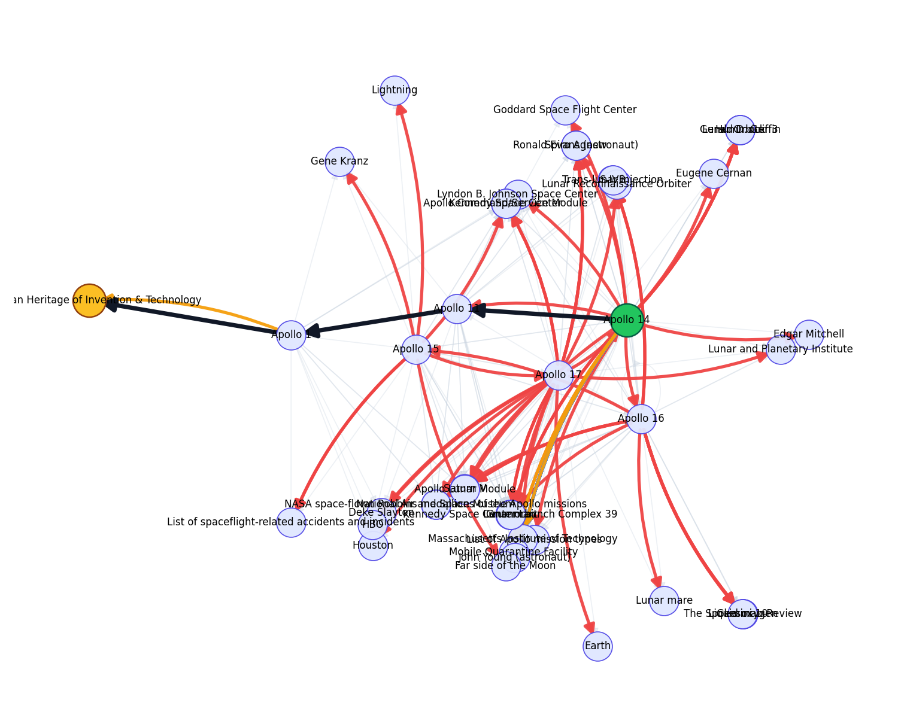

---

##### Abstract

The WikiRace game, where players navigate between Wikipedia articles using only hyperlinks, serves as a compelling benchmark for goal-directed search in complex information networks. This paper presents a systematic evaluation of navigation strategies for this task, comparing agents guided by graph-theoretic structure (betweenness centrality), semantic meaning (language model embeddings), and hybrid approaches. Through rigorous benchmarking on a large Wikipedia subgraph, we demonstrate that a purely greedy agent guided by the semantic similarity of article titles is overwhelmingly effective. This strategy, when combined with a simple loop-avoidance mechanism, achieved a perfect success rate and navigated the network with an efficiency an order of magnitude better than structural or hybrid methods. Our findings highlight the critical limitations of purely structural heuristics for goal-directed search and underscore the transformative potential of large language models to act as powerful, zero-shot semantic navigators in complex information spaces.

---

##### Figure

---
