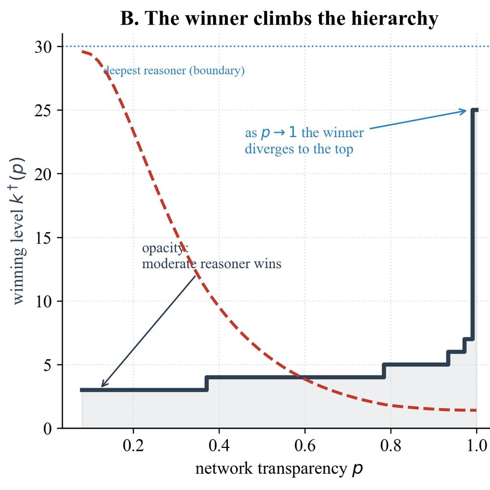

---

##### Abstract

Dashboards, feeds, and leaderboards determine whom agents believe they are playing against. We study how such information architectures shape strategic behavior, and how a designer who controls them can use visibility as a lever. We propose a behavioral model in which a transparency parameter governs how selectively agents are exposed to opponents of nearby reasoning depth, and embed it in a Cognitive Hierarchy environment, which provides a tractable language for tying agents' beliefs about the sophistication of others to what they see. We show that because the exposure operator is an exponential tilt of the type distribution, the effect of transparency on aggregate behavior has a closed form: the derivative of the aggregate action with respect to $p$ is proportional to the population-average variance of perceived sophistication. This identity signs the effect in games of strategic complements (opacity raises aggregate effort) and in coordination environments (opacity lowers the mean action), and an ordinal version holds for any response rule that is monotone in the belief. Notably, under a Poisson prior, opacity acts as a sophistication multiplier: every reasoner plays as if the population were $\mathrm{Poisson}(τ/p)$. We use this structure to characterize the disagreement-versus-level tradeoff faced by a coordination-minded designer, to identify the reasoning depths that respond most to visibility, and to show that opacity imposes a ``sophistication tax'' under which the deepest reasoners can lose to moderate ones. Simulations in which agents see only a noisy leaderboard of published actions reproduce both the reversal and the tax. Together, our findings highlight that who an agent sees, and not only how deeply it reasons, shapes strategic behavior, and point to visibility as a design lever.

---

##### Figure

