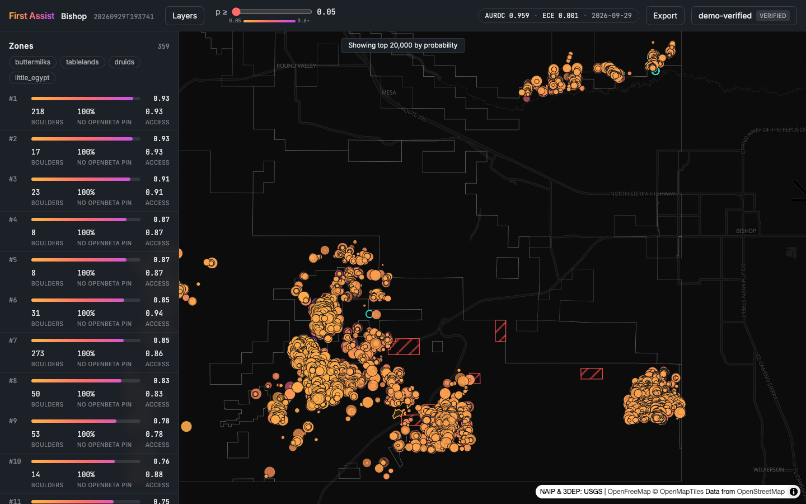

---

##### What it does

First Assist looks for boulders nobody has documented yet. For an area it pulls USGS 3DEP LiDAR, NAIP aerial
imagery and the OpenBeta climbing database, computes height above ground from the point cloud, segments
rock-sized objects, and scores each one with an ensemble (gradient boosting, a small CNN on image chips, and a
tabular transformer) trained on known boulders. The result is a ranked map of leads with confidence bands, land
ownership, approach estimates and GPX/KML export, plus tools for climbers to confirm, dispute and outline
boulders in the field. Everything is real public data; nothing is seeded.

---

##### Status

Live for Bishop, Joshua Tree, Black Mountain, San Diego, Donner Summit and the New River Gorge. The app runs on a
lab workstation and is open to people with an access key. If you climb and want one, email me.

---

##### Figure

